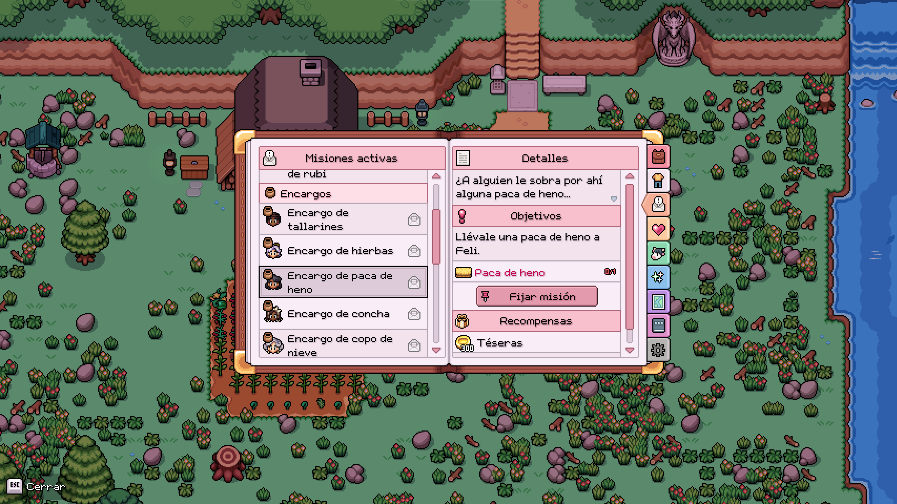
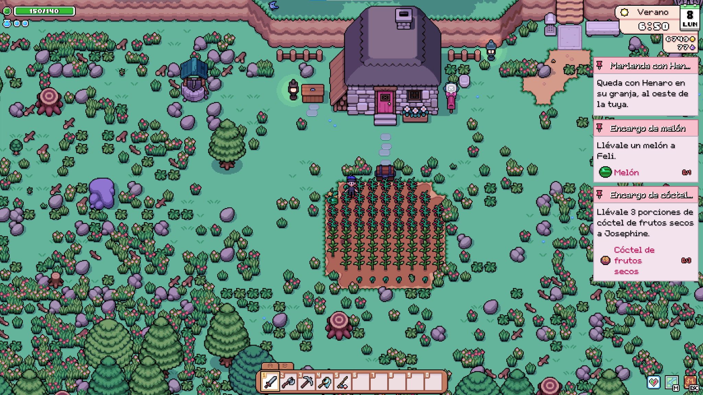
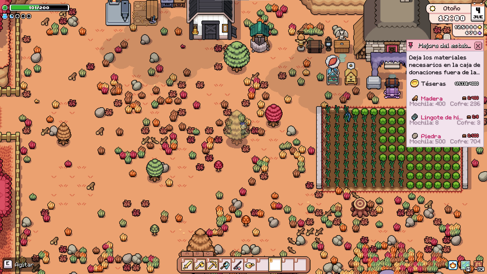

# Quest Pins

Pin active quests to a compact HUD panel and get an in-game sound plus notification when you obtain an item still needed by one of them.

## English

### Features

- Adds a **Pin quest / Unpin quest** button to active quest details in the Journal.
- Keeps up to three quests visible in a compact panel on either side of the HUD.
- Places the panel on either side of the HUD and dynamically follows the visible vanilla HUD above it: money and essence on the right, or health, stamina, mana, and status effects on the left.
- Keeps long quest titles on one line and shortens them with an ellipsis when necessary.
- Shows the current objective and every progress row supported by the vanilla Journal, including backpack items and seal offerings.
- Keeps requirement names to one line and shortens long item names with an ellipsis so multi-item quests remain compact.
- Caps objectives at two lines in Compact mode and three lines at every other width, adding an ellipsis when needed so narrow panels do not become taller than wider ones.
- Adds a small mouse-clickable **X** to each HUD card so it can be unpinned without reopening the Journal.
- Shows a vanilla storage icon and the amount kept in player-owned chests when the required item is missing from the backpack.
- For seal and donation-box objectives, keeps the main counter tied to items actually supplied and adds measured Backpack/Chest stock labels below it when relevant.
- For backpack-item objectives, marks active quests with a backpack and/or chest icon when useful required items exist in either source. Chest contents are also listed with exact quantities in the quest details, without requiring the quest to be pinned.
- Plays a subtle vanilla UI sound and shows a localized notification when a newly obtained item advances any active quest, whether pinned or not.
- Stores pinned quest keys in MMAPI's per-save sidecar; it does not alter the vanilla save.
- Supports mouse, keyboard, and controller navigation through the vanilla quest-detail pilot.
- Includes English and Spanish interface text.

### Screenshots

Pin or unpin an active quest directly from its Journal details:

Track several objectives and their live item progress from the game HUD:

Understand delivery progress without searching every storage container:

For delivery-box and seal objectives, the dark counter on the right remains the authoritative amount already delivered. The secondary **Backpack** and **Chest** values show stock you can use, but they do not count as quest progress until you deposit it. Empty sources are omitted to keep the card compact, and long item names are shortened without covering the counters.

### Requirements

- Fields of Mistria 1.0.4 (Steam build 24820767)
- MOMI/MMAPI 0.15.6 or newer

### Installation

Copy only the [`quest_pins`](quest_pins) directory into the game's `mods` directory, apply the mod with MOMI, and start the game.

### How it works

1. Open **Journal → Quests** and select an active quest.
2. Use **Pin quest** below its objectives. Up to three quests can be visible at once.
3. Close the Journal to see their current objectives and vanilla progress rows on the HUD.
4. Use the **X** in a card header or the **Unpin quest** button in the Journal to remove it.

Pinning and item alerts are independent. By default, obtaining a missing backpack item can notify you for **any active quest**, even when it is not pinned. Settings can restrict alerts to pinned quests only, and sound and visual notifications can be disabled separately. If one acquisition helps several monitored quests, each quest can receive its own notification while the confirmation sound plays only once.

Item alerts and the Journal chest marker use structured vanilla `has_item` requirements. They do not guess requirements from translated objective text and do not alert for currency, shipping, monster, delivery-box, seal, or other non-backpack progress. Loading a save or changing quest stages establishes a fresh inventory baseline instead of generating retroactive alerts.

The quest-list icons indicate where useful required items are currently available; they are not completion badges. A backpack icon means at least one required item is in your inventory. A chest icon means stored items can still help with a requirement not yet satisfied by the backpack. Both icons can appear together for mixed sources.

Chest quantities include player-owned chests registered by the game, regardless of their crafting-pull toggle. Shipping bins, machines, factories, feeders, and storage that does not belong to the player are excluded. Quest Pins only displays these quantities: it never moves items, counts them as delivered, or changes vanilla quest progress. Completed or otherwise inactive quests are removed from the HUD automatically.

The compact HUD intentionally shortens long titles, objectives, and item names. The complete text and normal quest controls remain available in the vanilla Journal.

### Configuration

Open **Journal → Settings → Quest Pins** to choose among five balanced panel widths (112, 136, 160, 184, and 208 pixels), place it on the left or right, select whether item alerts cover all active quests or pinned quests only, and enable or disable sounds and notifications. All active quests are monitored by default, and changes are saved immediately.

## Español

### Funciones

- Añade un botón **Fijar misión / Desfijar misión** a los detalles de cada misión activa.
- Mantiene hasta tres misiones visibles en un panel compacto en cualquiera de los laterales del HUD.
- Permite colocar el panel en cualquier lateral y sigue dinámicamente el HUD vanilla visible sobre él: dinero y esencias a la derecha; salud, energía, maná y efectos de estado a la izquierda.
- Mantiene los títulos largos en una sola línea y los acorta con puntos suspensivos cuando es necesario.
- Muestra el objetivo actual y todas las filas de progreso compatibles con el Diario vanilla, incluidos los objetos de la mochila y las ofrendas de los sellos.
- Mantiene cada requisito en una sola línea y acorta con puntos suspensivos los nombres largos para que las misiones con muchos objetos sigan siendo compactas.
- Limita los objetivos a dos líneas en el modo Compacto y a tres en las demás anchuras, añadiendo puntos suspensivos cuando sea necesario para que un panel estrecho no termine siendo más alto que uno ancho.
- Añade una pequeña **X** pulsable con el ratón a cada tarjeta del HUD para desfijarla sin volver a abrir el Diario.
- Si falta un objeto en la mochila pero está guardado, muestra el icono vanilla de almacenamiento y la cantidad disponible en los cofres del jugador.
- En objetivos de sellos y cajas de donaciones, mantiene el contador principal ligado a lo realmente entregado y añade debajo las cantidades disponibles en Mochila/Cofre cuando corresponda.
- En objetivos de objetos de mochila, marca las misiones activas con un icono de mochila y/o cofre cuando hay objetos necesarios útiles en cualquiera de las dos fuentes. También muestra el contenido de los cofres con cantidades exactas en los detalles, aunque la misión no esté fijada.
- Reproduce un sonido sutil del juego y muestra una notificación cuando un objeto recién obtenido ayuda a cualquier misión activa, esté fijada o no.
- Guarda las misiones fijadas por partida mediante el archivo auxiliar de MMAPI; no modifica el guardado original.
- Funciona con ratón, teclado y mando mediante la navegación vanilla del Diario.
- Incluye textos en inglés y español.

### Capturas

Fija o desfija una misión activa directamente desde sus detalles en el Diario:

Consulta varios objetivos y el progreso real de sus objetos desde el HUD del juego:

Comprueba el progreso de una entrega sin buscar en cada cofre:

En los objetivos de cajas de donaciones y sellos, el contador oscuro de la derecha sigue mostrando la cantidad realmente **entregada**. Los valores secundarios **Mochila** y **Cofre** indican las existencias disponibles, pero no cuentan para la misión hasta que las deposites. Las fuentes vacías se omiten para mantener la tarjeta compacta y los nombres largos se acortan sin tapar los contadores.

### Instalación

Copia únicamente la carpeta [`quest_pins`](quest_pins) dentro de `mods`, aplica el mod con MOMI e inicia el juego.

### Requisitos

- Fields of Mistria 1.0.4 (Steam build 24820767)
- MOMI/MMAPI 0.15.6 o posterior

### Uso

1. Abre **Diario → Misiones**.
2. Selecciona una misión activa.
3. Pulsa **Fijar misión** bajo sus objetivos.
4. Cierra el Diario: el objetivo queda visible en el lateral elegido.
5. Usa la **X** de la tarjeta o el botón **Desfijar misión** del Diario para quitarla.

Fijar misiones y recibir avisos son funciones independientes. De forma predeterminada, conseguir un objeto pendiente en la mochila puede avisarte para **cualquier misión activa**, aunque no esté fijada. Los ajustes permiten limitar los avisos a las misiones fijadas y desactivar por separado el sonido y las notificaciones visuales. Si un mismo objeto ayuda a varias misiones vigiladas, cada misión puede mostrar su propio aviso, pero el sonido se reproduce una sola vez.

Los avisos y el marcador de cofres del Diario se limitan a requisitos estructurados `has_item`. No intentan deducir requisitos leyendo el texto traducido ni avisan de dinero, envíos, monstruos, cajas de donaciones, sellos u otros progresos que no dependan de la mochila. Al cargar una partida o cambiar de etapa de misión se crea una nueva referencia del inventario, evitando avisos retroactivos.

Los iconos de la lista indican dónde hay objetos necesarios que pueden ayudar; no significan que la misión esté completada. La mochila indica que tienes al menos un objeto requerido en el inventario. El cofre indica que hay objetos guardados útiles para un requisito que la mochila todavía no cubre. Ambos pueden aparecer a la vez cuando el material está repartido.

Las cantidades de cofres incluyen los cofres del jugador registrados por el juego, aunque tengan desactivado el uso de materiales para fabricar. Se excluyen el buzón de envíos, máquinas, fábricas, comederos y almacenes que no pertenecen al jugador. Quest Pins solo muestra esas cantidades: nunca mueve los objetos, los cuenta como entregados ni modifica el progreso vanilla. Las misiones completadas o que dejan de estar activas se eliminan automáticamente del panel.

El HUD compacto acorta deliberadamente los títulos, objetivos y nombres de objetos largos. El texto completo y los controles normales de la misión siguen disponibles en el Diario vanilla.

### Configuración

Abre **Diario → Ajustes → Quest Pins** para elegir entre cinco anchuras equilibradas —112, 136, 160, 184 y 208 píxeles—, colocar el panel a la izquierda o a la derecha, decidir si los avisos cubren todas las misiones activas o solo las fijadas, y activar o desactivar el sonido y las notificaciones. De forma predeterminada se vigilan todas las misiones activas. Los cambios se guardan inmediatamente.
